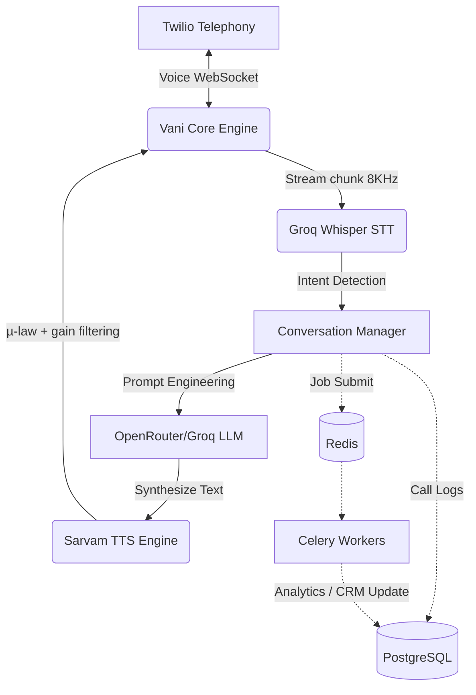

<div align="center">

# 🎙️ Vani AI: Outbound Sales Agent
**Ultra Low-Latency Conversational AI for Next-Gen Telephony**

[](https://fastapi.tiangolo.com/)
[](https://python.org)
[](https://www.twilio.com/)
[](https://redis.io/)
[](https://docs.celeryq.dev/en/stable/)

<p align="center">
  <em>A production-ready AI outbound caller featuring ultra-low latency real-time voice streaming, Indic language support, dynamic soft-barge-in, and post-call analytics.</em>
</p>

</div>

---

## ✨ Features

- **⚡ Sub-Second Latency:** Ultra-optimized websocket connections merging VAD, early-LLM prompts, and asynchronous TTS to achieve < 800ms conversational turnarounds.
- **🗣️ Advanced Indic Support:** Deeply integrated with Sarvam AI for flawless understanding and generation of Hindi, Marathi, Bengali, Tamil, Telugu, and more natively.
- **🛡️ Soft Barge-In System:** Detects user overlaps instinctively to halt TTS gracefully using confidence-gated STT buffering.
- **⚙️ Dynamic Conversational Engine:** Driven by Llama-3 (70B) via OpenRouter/Groq, injecting dynamic context including custom tenant limits, live intents, and multi-stage sales funnels.
- **📊 Realtime Analytics:** Post-call async ingestion using Celery and Redis to extract deep insights, qualification scores, and CRM metadata without blocking server processing threads.

---

## 🏗️ Architecture Engine

Vani relies on a robust real-time microservice architecture ensuring stability across massive outbound dial spikes.



---

## 🚀 Quickstart Guide

### 1. Prerequisites
Ensure you have the following installed on your machine:
* **Python 3.10+**
* **PostgreSQL** & **Redis** (Locally or via Docker)
* **Ngrok** (For testing Twilio Webhooks natively)

### 2. Installation
Clone the repository and spin up a secure virtual environment.
```bash
git clone https://github.com/adminforhtt/Outbound-Sales-Agent-VaniAI.git
cd Outbound-Sales-Agent-VaniAI

python -m venv venv
source venv/bin/activate
pip install -r requirements.txt
```

### 3. Environment Variables
Copy the secure environment template:
```bash
cp .env.example .env
```
Populate your `.env` securely with your **Twilio**, **Sarvam AI**, and **OpenRouter / Groq** credentials. *Make sure to update `BASE_URL` with your active Ngrok endpoint!*

### 4. Running the Servers

**Spin up Redis Queue Server:**
```bash
docker run -p 6379:6379 -d redis
```

**Launch the Vani API Core:**
```bash
uvicorn app.main:app --reload --port 8000
```

**Expose Twilio Webhook (In a new terminal):**
```bash
ngrok http 8000
```

**Start the Notification Celery Worker:**
```bash
export $(cat .env | xargs)
celery -A app.workers.celery_app worker --loglevel=info
```

---

## 📚 API Reference

Easily interact with the platform natively through our auto-generated Swagger UI interface. Once bounded locally via Uvicorn, visit:

📍 **OpenAPI Docs:** [http://localhost:8000/docs](http://localhost:8000/docs)

### Triggering a Test Call
```bash
curl -X 'POST' \
  'http://localhost:8000/api/calls/test-call' \
  -H 'accept: application/json' \
  -H 'Content-Type: application/json' \
  -d '{
  "phone_number": "+1234567890",
  "script": "You are selling high level AI Architecture.",
  "llm_provider": "groq",
  "voice": "kavya",
  "language": "hi-IN"
}'
```

---

<div align="center">
  <b>Built with ❤️ for Intelligent AI Voice Pipelines.</b><br>
  <i>Empowering Next Generation Call Centers globally.</i>
</div>
