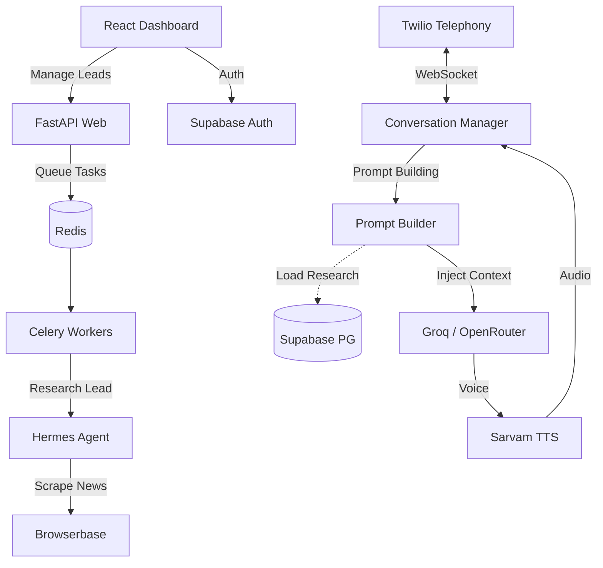

<div align="center">

# 🎙️ Vani AI: Enterprise Outbound Sales Agent
**Production-Grade Conversational AI for Multi-Tenant SaaS**

[](https://railway.app/)
[](https://vercel.com/)
[](https://supabase.com/)
[](https://fastapi.tiangolo.com/)

<p align="center">
  <em>A high-performance outbound caller featuring ultra-low latency streaming, multi-tenant SaaS architecture, autonomous lead research (Hermes), and production-ready cloud deployment.</em>
</p>

</div>

---

## 🚀 Key Production Features

- **⚡ Ultra-Low Latency:** Sub-800ms turn-around time using optimized WebSockets, VAD-gated streaming, and Groq/OpenRouter acceleration.
- **🛰️ Hermes Intelligence Engine:** Pre-call autonomous lead research using **Nous Research Hermes** + Browserbase. Scrapes the live web to generate personalized scripts and icebreakers.
- **🛡️ Enterprise Multi-Tenancy:** Powered by **Supabase Auth** and PostgreSQL. Strict Row-Level Security (RLS) and tenant isolation for multiple business users.
- **🗣️ Native Indic Support:** Flawless conversational fluency in 11+ Indic languages (Hindi, Marathi, Bengali, Tamil, etc.) via **Sarvam AI**.
- **💳 Fully Integrated SaaS:** Built-in billing logic, Razorpay support, and automated credit tracking per tenant.

---

## 🏗️ Cloud-Native Architecture

Vani AI is designed for horizontal scale across Railway (Backend) and Vercel (Frontend).



---

## 🛠️ Deployment (Phase 7)

### 1. Backend (Railway)
The backend is configured to run dual services from a single repository:
*   **Web**: `uvicorn app.main:app --host 0.0.0.0 --port $PORT`
*   **Worker**: `celery -A app.workers.celery_app worker --loglevel=info`

### 2. Frontend (Vercel)
The React/Vite frontend is optimized for Vercel:
*   **Rewrites**: Configured in `vercel.json` for SPA routing.
*   **API Connection**: Uses `VITE_API_URL` to securely talk to the Railway backend.

### 3. Database (Supabase)
*   **Auth**: Social & Email login managed via Supabase.
*   **Schema**: Automated migrations via SQLAlchemy models in `app/models/core.py`.

---

## 📦 Getting Started

### 1. Installation
```bash
git clone https://github.com/adminforhtt/VaniAI-Outbound-Calls-Sales-Agent.git
cd VaniAI-Outbound-Calls-Sales-Agent
pip install -r requirements.txt
```

### 2. Environment Setup
Create a `.env` file with the following:
```env
# Twilio
TWILIO_ACCOUNT_SID=
TWILIO_AUTH_TOKEN=
TWILIO_PHONE_NUMBER=

# AI & LLM
SARVAM_API_KEY=
OPENROUTER_API_KEY=
GROQ_API_KEY=

# SaaS / Infra
SUPABASE_URL=
SUPABASE_ANON_KEY=
DATABASE_URL=
REDIS_URL=
BROWSERBASE_API_KEY=
```

### 3. Development
```bash
# Start Backend
uvicorn app.main:app --reload

# Start Frontend
cd frontend && npm run dev

# Start Worker
celery -A app.workers.celery_app worker --loglevel=info
```

---

## 📚 API Reference
Access our interactive Swagger documentation at `BASE_URL/docs` once the server is running.

---

<div align="center">
  <b>Vani AI: Empowering the Next Generation of Intelligent Voice Pipelines.</b><br>
  <i>Built for scale. Built for conversion.</i>
</div>
